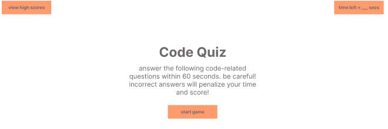
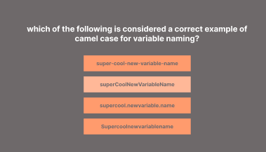
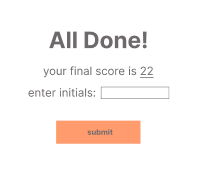
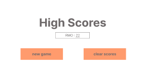

# Code Quiz

[Take the quiz!](https://overtonr.github.io/code-quiz/)



<br>

## Description:
Application 10 question multiple-choice quiz that lasts 80 seconds. Users also have the option to store their high-scores when the quiz is over, and a button with the ability to clear their stored high scores.

## Table of Contents
---
- [Usage](#usage)
- [Technologies Used](#technologies-used)
- [License](#license)
- [Questions](#questions)

## Usage: 
This timed multiple-choice quiz starts when the start button is pressed.

```javascript
startBtn.addEventListener("click", startQuiz);

function startQuiz() {
    startCon.classList.add("hide");
    currentQues = 0;
    questionCon.classList.remove("hide");
    timerFun();
    showQues(quesArr[currentQues]);
}
```

 The application will dynamically append each question with the associated answer options

```javascript
function setQues(question) {
    questionEl.textContent = question;
};

function setAns(ans) {
    ansBtns.innerHTML = " ";
    for (i in ans) {
        var ansOpt = document.createElement("button")
        ansBtns.appendChild(ansOpt);
        ansOpt.setAttribute("class", "ans");
        ansOpt.textContent = (ans[i].text);
        ansOpt.addEventListener("click", function (e) {
        ansSelect(e.target);
      })}
};
```

Users have 80 seconds to answer all 10 questions. The faster the users selects all the correct answers, the higher their score will be. 

 

If a user chooses incorrectly, 10 seconds will be penalized from the time-score. The goal is to try to get the most amount of questions correct in the fastest time possible.
When the game is over, users have the ability to store their score alongside their initials.

 

After submitting the form, they have the ability to restart the quiz and attept to get a faster time. There is also the option to clear these scores from the leaderboard.



## Technologies Used:
* Github
* HTML
* CSS
* JavaScript
* VS Code

## License 
Please refer to the license in the repository.

## Questions
https://github.com/overtonr

